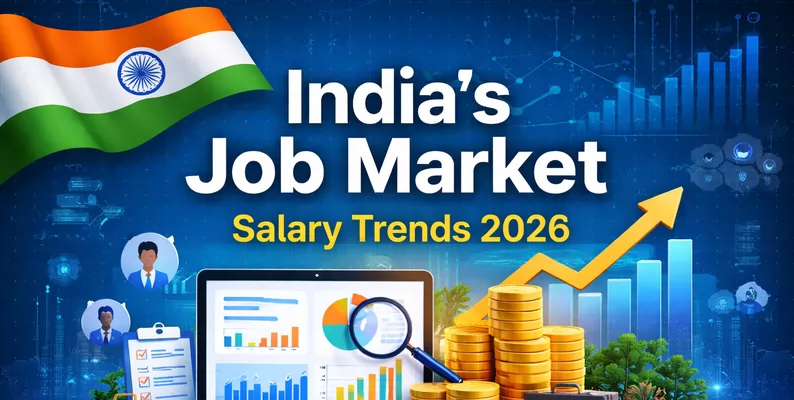
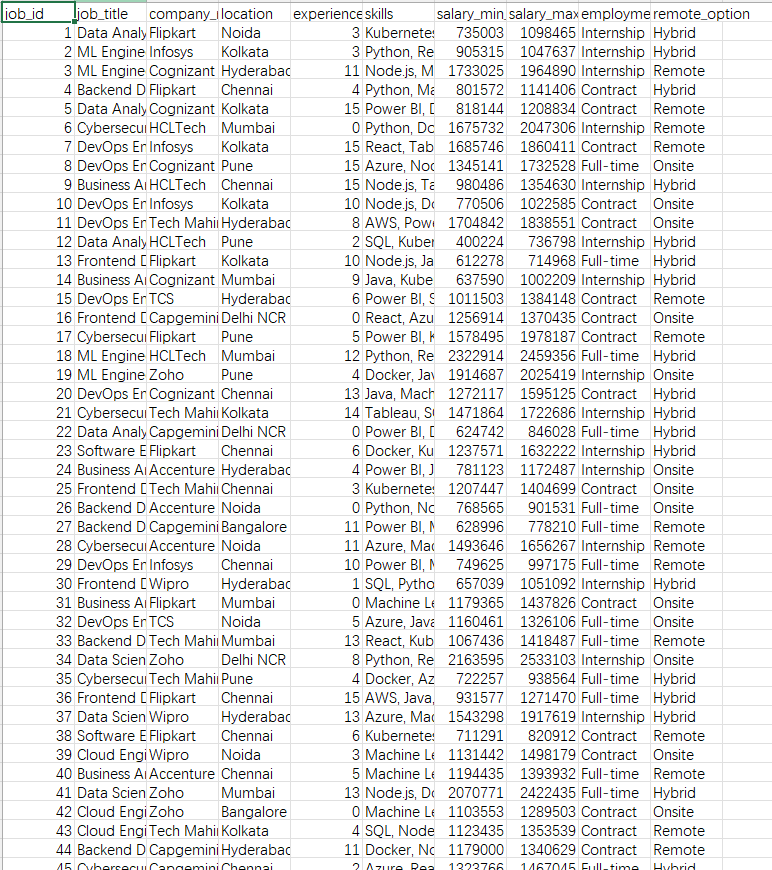

## Body

India 2026 Employment Market and Salary Trend Analysis

This dataset contains 10,000 clean and structured records representing the employment market and salary trends in India for the year 2026. The dataset includes key attributes such as job title, company name, location, required experience, skills, salary range, employment type, and remote work options.
All records have been fully cleaned, with no missing values or duplicates, thus ready for machine learning and data analysis tasks.

This dataset can be used for:
• Salary forecasting (regression models)
• Career trend analysis
• Skill demand analysis
• Human resource analysis projects
• Employment pattern research
The structure of this dataset is designed to simulate the real industry salary ranges for different technical positions in India.

## Images

Here is a pay link on Stripe ( https://buy.stripe.com/3cs8yP7sY87d0vu9AB ). Please contact me lonlonago@foxmail.com after funding $89, and I will send you a complete data files , thank you!

